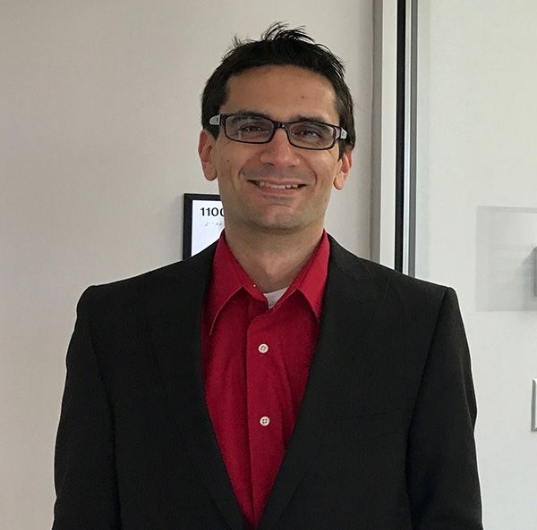

<h2>Meet the Instructors</h2>

    

        

        
<h4>Jessica Nash</h4>

        
PhD Materials Science and Engineering NC State University

        

            
<strong>Expertise:</strong>

            
Python programming language, web development, molecular dynamics simulations and materials science

        

    

    

    

        

        
<h4>Benjamin Pritchard</h4>

        
PhD Chemistry University at Buffalo

        

            
<strong>Expertise:</strong>

            
C/C++, High Performance Computing, Linux, quantum chemistry

        

    

